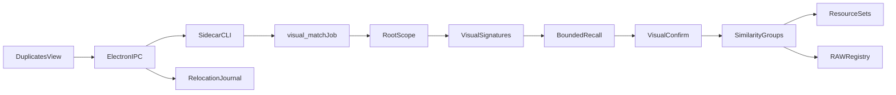

# Duplicate, Similar, Crop, and Source Matching

This document is the implementation contract for AfterFrame's catalog-scoped
photo cleanup workflow.

## Product boundary

- A catalog is the complete search universe. Matching never walks outside its
  registered roots.
- Adding a root indexes file references; it does not copy source files into the
  `.afcatalog`.
- A scan has explicit probe roots and a bounded gallery scope.
- Every detected relationship is a proposal until the user confirms it.
- No matching path may fall back to comparing a probe against the whole
  catalog.

## Relationship semantics

| Relationship | Meaning | Confirmation effect |
| --- | --- | --- |
| `duplicate` | Same physical content | May join one resource set |
| `compressed_of` | Same full frame, different encoding or size | Joins one resource set |
| `crop_of` | Child is a region of the parent | Joins one resource set |
| `burst_sibling` | Distinct exposure in a burst | Review group only |
| `visually_similar` | Similar but not proven to be the same frame | Review group only |
| `raw_candidate` | Possible canonical RAW source | Calls `confirm_match` only |

Pending proposals live in similarity tables. Confirmed same-photo facts also
write `asset_links`; only exact, compressed, and crop families modify
`resource_sets`. Burst and visually-similar groups never merge identities.

## Call and ownership graph

The Python sidecar owns catalog state, signatures, matching, groups, and
resource-set transactions. Electron main owns operating-system file operations.
The renderer never supplies authoritative catalog paths for destructive work.

## Search complexity

For each probe asset, candidate recall is an indexed union with per-channel
quotas and a final hard cap `K`:

1. normalized filename/stem family;
2. capture-time window plus camera;
3. exact perceptual hash;
4. four-band multi-index perceptual-hash lookup;
5. fixed-count region-hash lookup for crops;
6. existing bounded RAW candidate recall for RAW proposals.

Only the shortlisted candidates receive visual confirmation. Full-frame visual
work is therefore bounded by `probe_count × K`. Crop confirmation additionally
caps parent candidates, pyramid scales, coarse regions, and refinements.
Near-duplicate clustering caps edges, degree, and component size.

There is no all-pairs fallback, including debug and empty-shortlist paths.

## Root scope

`catalog_roots.user_declared` distinguishes folders explicitly chosen by the
user from implicit roots recorded during import. `asset_root_memberships`
assigns an asset to the longest matching active user root. Scope resolution is
centralized in `db/roots.py`; matching code does not construct path-prefix SQL.

Relink and relocation recompute membership. Image roots are ordinary
probe/gallery roots. RAW roots participate only in RAW-source proposals.

## Signature contract

- Inputs are normalized 512-pixel previews.
- Signature records include the preview fingerprint and algorithm version.
- A 64-bit DCT pHash is stored with four indexed 16-bit bands.
- Crop recall uses a fixed, versioned number of region signatures per asset.
- Changed previews or algorithms invalidate signatures incrementally.
- Thresholds are selected from ground truth, not hard-coded from intuition.

## File-safety contract

- Catalog-only removal never touches source files.
- Trash removes catalog records only for files successfully moved to Trash.
- Same-volume relocation uses atomic rename.
- Cross-volume relocation copies to a `.partial` file, verifies size and a full
  content hash, atomically renames the destination, relinks the catalog, and
  only then trashes the source.
- A persistent journal records each relocation state. Failures preserve at
  least one verified copy and are resumable or explicitly recoverable.
- No silent overwrite and no fallback to permanent unlink.

## Ground truth

Visual truth CSV columns:

- `probe_path`
- `gallery_path`
- `relation`
- `notes`

Allowed `relation` values:

- `exact`
- `compressed_of`
- `crop_of`
- `burst_sibling`
- `near_duplicate`
- `raw_candidate`
- `negative`
- `negative_burst`
- `negative_crop`

Recall and confirmation are evaluated separately:

- `Recall@K`: expected partner appears in the bounded shortlist.
- Precision/false-attach rate: confirmation assigns the correct relationship.

The first release gate targets at least `0.95` Recall@K and at most `0.02`
false same-photo attachment on the curated negative set. Results must include
the chosen `K`, algorithm version, thresholds, and fixture identity.

## Non-negotiable compatibility

- `reverse_lookup` thresholds and automatic RAW binding stay unchanged.
- RAW visual proposals confirm only through the existing `confirm_match`.
- Existing exact-fingerprint Inspector behavior remains available.
- Schema migrations never hash or scan the image library.
